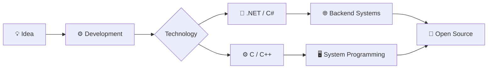

<div align="center">

# The-Gençtürk

### `.NET Developer` - `C/C++ Developer` - `Open Source Contributor` - `OS Enthusiast`


<br>


</div>

---

## About Me

```text
╭────────────────────────────────────────────────────────────╮
│                                                            │
│   🚀 .NET Developer                                        │
│   ⚙️  C / C++ Developer                                    │
│   🖥️  Operating System Development Enthusiast             │
│   🌐 Open Source Developer                                 │
│   🔧 Backend & Systems Programming                         │
│                                                            │
╰────────────────────────────────────────────────────────────╯
```

I'm a software developer focused on **.NET development**, while also exploring the lower levels of computing with **C and C++**.

My interests range from building scalable backend systems to understanding what happens underneath them — including **operating systems, memory, processes, low-level programming and system architecture**.

I enjoy building things from scratch, experimenting with new technologies and contributing to the **open-source ecosystem**.

> **High-level applications meet low-level systems.**

---

## ⚡ What I Work With

<table>
<tr>
<td valign="top" width="50%">

### 💻 Application Development

* 🔷 C#
* 🔷 .NET / ASP.NET Core
* 🔷 Entity Framework Core
* 🔷 REST APIs
* 🔷 SQL Server
* 🔷 PostgreSQL
* 🔷 Python / FastAPI
* 🔷 JavaScript

</td>

<td valign="top" width="50%">

### 🖥️ Systems & Low Level

* ⚙️ C
* ⚙️ C++
* 🧠 Memory Management
* 🔌 System Programming
* 🖥️ Operating Systems
* 🔬 Reverse Engineering
* 🧩 Data Structures & Algorithms
* 🛠️ Debugging & Performance

</td>
</tr>
</table>

---

## 🛠️ Tech Stack

### Languages

<p>


</p>

### Backend & Frameworks

<p>


</p>

### Databases

<p>


</p>

### Tools & Environment

<p>


</p>

---

## 🚀 Featured Areas



### 🔷 .NET Development

Building backend applications and APIs with:

* ASP.NET Core
* Entity Framework Core
* SQL Server / PostgreSQL
* Authentication & Authorization
* Background Services
* Caching
* Middleware
* RESTful APIs
* Scalable application architecture

### ⚙️ C / C++

Exploring the lower layers of software:

* Operating system concepts
* Memory management
* Processes & threads
* CPU / hardware interaction
* System calls
* File systems
* Low-level architecture
* Performance-oriented programming

---

## 🌐 Open Source

I believe software becomes better when developers **build, share and learn together**.

I'm interested in:

```text
Open Source
    │
    ├── 🧩 Building useful tools
    ├── 🐛 Fixing bugs
    ├── 📚 Learning from other developers
    ├── 🔧 Improving existing projects
    └── 🚀 Creating projects from scratch
```

---

## 📊 GitHub Stats

<div align="center">


<br><br>


</div>

---

## 🐍 Contribution Activity

<div align="center">


</div>

---

## 📈 Contribution Graph

<div align="center">


</div>

---

## 💻 Current Focus

```csharp
while (true)
{
    Learn();
    Build();
    BreakThings();
    Debug();
    Improve();
}
```

### 🔭 Currently exploring

* 🖥️ Operating System Development
* ⚙️ C / C++ System Programming
* 🔷 Advanced .NET
* 🧠 Low-Level Computer Architecture
* 🌐 Open Source Projects
* 🚀 Performance & Scalability

---

## 🤝 Let's Connect

<div align="center">

<a href="https://github.com/The-Gencturk">

</a>

<a href="https://www.linkedin.com/in/eymen-gencturk/">

</a>

<a href="mailto:eymengencturk2008@gmail.com">

</a>

</div>

<br>

<div align="center">

### ⭐ If you find my projects useful, consider giving them a star!


</div>
